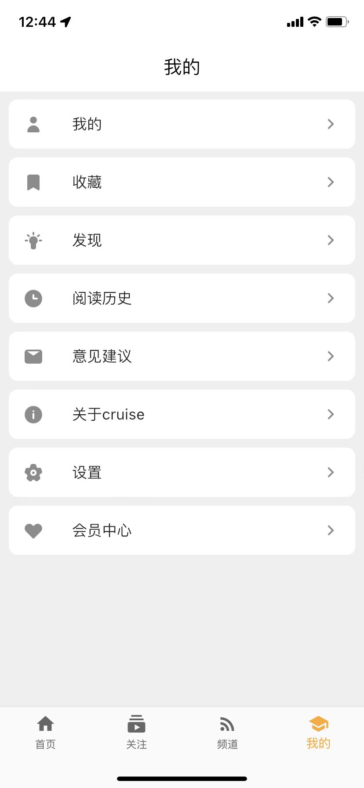

# cruise-open

english | [中文](https://github.com/jiangxiaoqiang/cruise-open/blob/main/README.zh-CN.md)

Cruise is a simple RSS reader across all platform.

## Background

I was suffered by some low quality article from bunch of news application. So I want to write a RSS reader to change the situation.

## Cruise

### how to build

```bash
export PUB_HOSTED_URL=https://pub.flutter-io.cn \ 
&& export FLUTTER_STORAGE_BASE_URL=https://storage.flutter-io.cn \
&& ~/apps/flutter/bin/flutter run -v
```

If using fvm to manage the flutter sdk version, using this command:

```bash
export PUB_HOSTED_URL=https://pub.flutter-io.cn \
&& export FLUTTER_STORAGE_BASE_URL=https://storage.flutter-io.cn \
&& ~/fvm/versions/2.10.3/bin/flutter run -v
```

build the ipa(iOS and iPadOS application archive file) package so that you can install into your own iOS devices, you can use altstore to install the ipa into your iOS devices without jailbreak or pay money for sign the app:

```bash
~/fvm/versions/{version}/bin/flutter build ipa --export-options-plist=/Users/xiaoqiangjiang/source/reddwarf/frontend/cruise-open/ios/Runner/Info.plist --release
~/fvm/versions/3.3.0/bin/flutter build ipa --export-options-plist=/Users/xiaoqiangjiang/source/reddwarf/frontend/cruise-open/ios/Runner/Info.plist --release
```

run cruise in your devices without the usb cable connection, this application only valid for 7 days with iOS devices：

```bash
~/fvm/versions/{version}/bin/flutter run --release
```

### UI

|         |  |
| --------------------------------------- | ------------------------------- |
|  |                                 |
